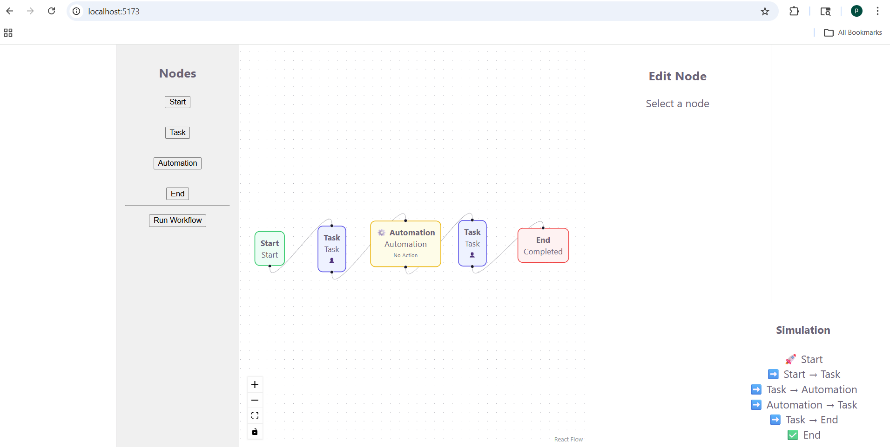

# 🧩 HR Workflow Designer (React + React Flow)

## 🚀 Overview

This project is a visual workflow builder for HR processes such as onboarding, leave approvals, and automation flows.

Users can design workflows by dragging nodes, connecting them, configuring each step, and simulating execution.

---
## 📸 Project Preview



## ✨ Features

### 🔹 Node Types

* Start Node (entry point)
* Task Node (manual/human step)
* Automation Node (system action via mock API)
* End Node (completion)

---

### 🔹 Core Functionalities

* Drag-and-drop workflow canvas (React Flow)
* Connect nodes with edges
* Dynamic node editing panel
* Workflow validation (Start & End required)
* Simulation panel (step-by-step execution logs)
* Mock API integration for automation actions

---

## 🛠 Tech Stack

* React (Vite)
* React Flow
* JavaScript
* Local Mock API

---

## 🧠 Architecture

* Modular node-based system
* Controlled graph state using:

  * `useNodesState`
  * `useEdgesState`
* Separation of concerns:

  * UI (nodes)
  * Logic (App.jsx)
  * Data/API (mockApi.js)

---

## ▶️ How to Run

```bash
npm install
npm run dev
```

Open in browser:
http://localhost:5173/

---

## ⚙️ Design Decisions

* Used React Flow for scalable graph-based workflows
* Implemented custom node components for flexibility
* Simulation engine mimics workflow execution
* Validation ensures correct workflow structure

---

## 🔮 Future Improvements

* Save & load workflows
* Undo/Redo functionality
* Role-based approvals
* Auto layout for nodes
* Visual error highlighting

---

## 📌 Conclusion

This prototype demonstrates a scalable and extensible workflow system that can be expanded into a full HR automation platform.
